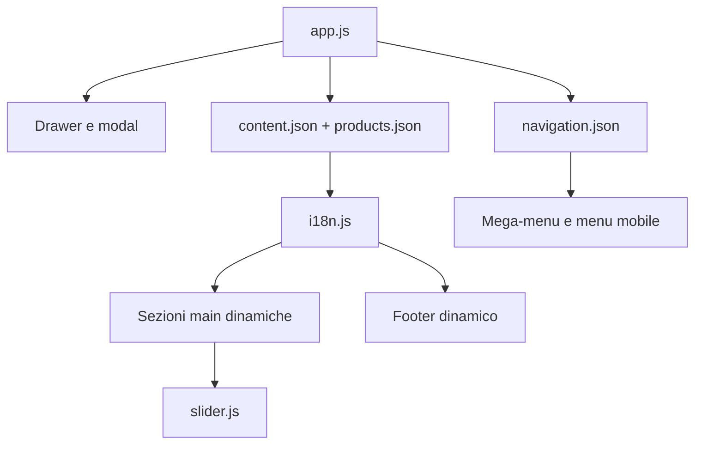

# Architettura front-end

## Obiettivo

Il prototipo è volutamente framework-agnostic. La struttura mostra i confini da preservare anche in React, Vue, Angular, Twig o in un'altra piattaforma: shell HTML, contenuti editoriali, catalogo, navigazione e comportamenti interattivi rimangono moduli indipendenti.

## Flusso di inizializzazione

`app.js` inizializza subito i controlli che non dipendono dai dati. Contenuti e navigazione vengono poi caricati in parallelo. Un errore in un ramo viene segnalato senza impedire all'altro ramo di completare il rendering.

## Responsabilità dei moduli

| Modulo | Responsabilità | Non deve fare |
|---|---|---|
| `app.js` | bootstrap, dipendenze DOM, isolamento errori | generare markup di sezione |
| `content.js` | comporre main/footer e media art-directed dai contratti JSON | gestire menu o focus del modal |
| `catalog.js` | creare card e risolvere route prodotto | effettuare fetch autonomi |
| `i18n.js` | scegliere lingua e tradurre la shell | contenere testi editoriali hardcoded |
| `navigation.js` | mega-menu, accordion e drawer | conoscere i prodotti |
| `product-modal.js` | quick view e accessibilità dialog | recuperare dati remoti |
| `search.js` | validazione e route ricerca | eseguire logica e-commerce |
| `slider.js` | autoplay, frecce, tastiera, swipe e pausa | conoscere contenuti o catalogo |
| `utils.js` | primitive condivise | conoscere componenti applicativi |

## Sicurezza del rendering

I valori provenienti dai JSON vengono inseriti tramite `textContent` e attributi DOM. Non viene usato `innerHTML`; questo riduce il rischio di introdurre markup non attendibile quando il mockup verrà collegato a un CMS.

Gli URL sono comunque dati sensibili: nel software definitivo devono essere prodotti dal router applicativo o validati lato server. La Content Security Policy deve consentire soltanto le origini realmente necessarie.

## Gestione errori

- `fetchJson` applica timeout e verifica lo stato HTTP.
- La navigazione espone un messaggio locale nel drawer.
- Main/footer mantengono una shell semantica e mostrano uno stato leggibile se i dati non arrivano.
- Gli errori vengono inviati a `console.error` come punto di sostituzione per Sentry, Datadog o la soluzione scelta.

## Accessibilità

- landmark e gerarchia titoli coerente;
- skip link al main;
- `aria-busy` durante il caricamento;
- lingua documento aggiornata con `html[lang]`;
- selettore lingua duplicato nel drawer e sincronizzato sullo stesso stato attivo;
- drawer e modal con focus trap, ripristino del focus e chiusura con `Esc`;
- sfondo reso `inert` durante il quick view;
- hover prodotto equivalente anche con focus da tastiera;
- slider controllabile con frecce e tastiera, in pausa durante l’interazione;
- supporto a `prefers-reduced-motion`.

## Responsive

I breakpoint principali sono:

| Soglia | Comportamento |
|---|---|
| `> 1360px` | header completo, griglia fino a 6 colonne |
| `1181–1360px` | header compatto, griglia a 4 colonne |
| `≤ 1180px` | drawer mobile, header essenziale |
| `≤ 700px` | slider `3:1`, banner `4:1`, griglie a 2 colonne |
| `≤ 600px` | modal a colonna singola |

Nessun prodotto viene nascosto ai breakpoint: cambia soltanto il numero di colonne.
