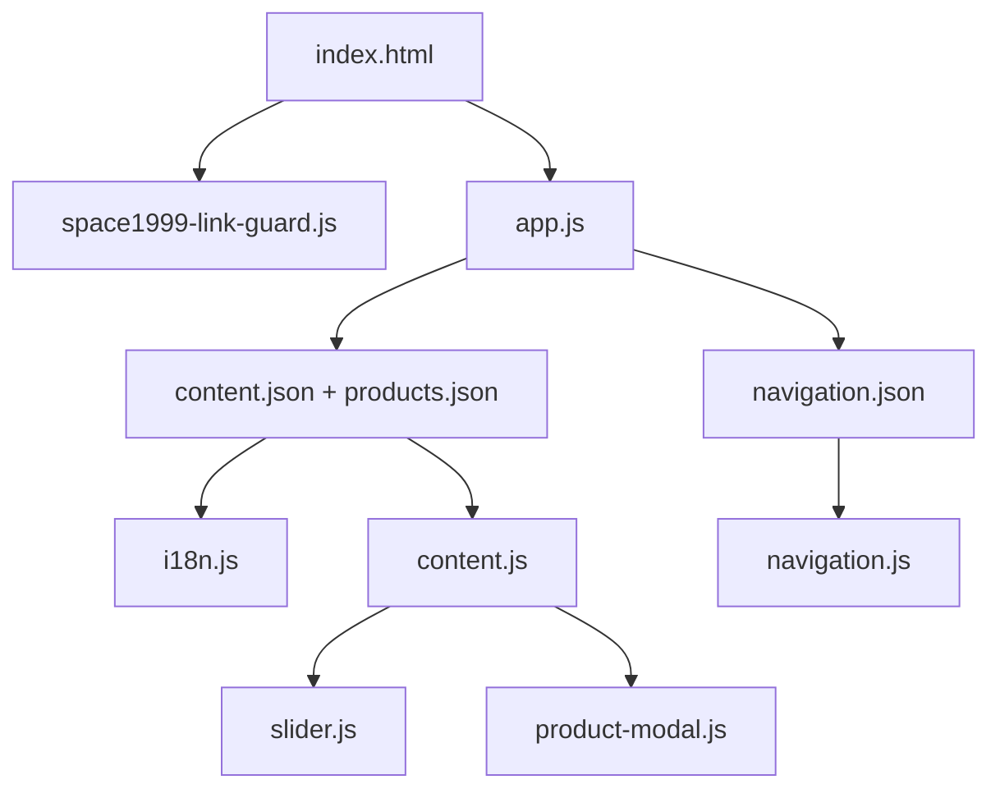
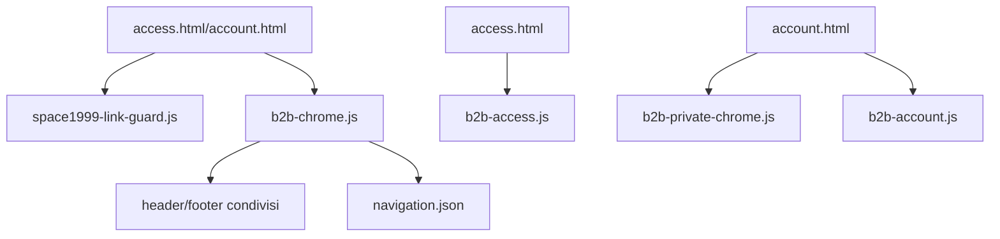

# Architettura front-end

## Obiettivo

Il progetto è framework-agnostic e separa shell HTML, contenuti JSON e comportamenti JavaScript. La documentazione descrive lo stato corrente del prototipo; non definisce da sola i requisiti backend o di business del prodotto definitivo.

## Flusso home pubblica

`space1999-link-guard.js` viene caricato prima del bootstrap principale e rimuove target navigabili verso `space1999.com` o relativi sottodomini. Il resto del frontend continua poi con caricamento contenuti, prodotti e navigazione.

## Flusso pagine B2B

Su `account.html`, `b2b-private-chrome.js` sostituisce il login pubblico con `Carrello` e `Area riservata`, sincronizzando il badge quantità con la navigazione privata.

## Responsabilità dei moduli

| Modulo | Responsabilità |
|---|---|
| `app.js` | bootstrap home e isolamento errori |
| `content.js` | rendering main/footer |
| `catalog.js` | card prodotto e href di catalogo |
| `i18n.js` | lingua e traduzioni UI |
| `navigation.js` | mega-menu e drawer mobile |
| `product-modal.js` | quick view e focus dialog |
| `search.js` | comportamento dei form ricerca |
| `slider.js` | autoplay, controlli e swipe |
| `utils.js` | fetch, DOM, focus e filtro target Space1999 |
| `space1999-link-guard.js` | sanificazione globale di `href`, `action`, `data-url` |
| `b2b-utils.js` | primitive DOM/formati B2B e filtro target Space1999 |
| `b2b-chrome.js` | header/footer condivisi nelle pagine B2B |
| `b2b-private-chrome.js` | variante header autenticata e badge carrello |
| `b2b-access.js` | login/request/reset dimostrativi |
| `b2b-account.js` | shell e viste private |

## Politica URL

Il mockup non deve navigare verso `space1999.com` o suoi sottodomini.

La protezione è ridondante intenzionalmente:

- gli URL hardcoded di navigazione sono rimossi dalle shell;
- `createElement()` in `utils.js` scarta `href`, `action` e `data-url` bloccati;
- le primitive B2B applicano lo stesso criterio;
- `space1999-link-guard.js` osserva il DOM e ripulisce target aggiunti dinamicamente.

La regola non blocca `src` o `srcset` di immagini remote.

## Rendering e sicurezza

I testi provenienti dai JSON vengono inseriti con `textContent` o attributi DOM. I dati demo non devono essere considerati fidati nel prodotto reale: il backend dovrà validare payload, permessi, tenant e URL.

L’uso di una guardia client-side non sostituisce Content Security Policy, routing applicativo e controlli server-side.

## Area privata

La configurazione cliente demo espone `dashboard`, `cart`, `orders`, `shipments`, `documents`, `profile` e `carriers`.

Non esistono più nella navigazione privata:

- voce `Catalogo`;
- link “Torna al catalogo”.

Il form login è una funzione della chrome pubblica. Nell’area privata viene sostituito dalla chrome autenticata.

## Gestione errori

- `fetchJson` applica timeout e controllo dello stato HTTP;
- contenuti e navigazione vengono caricati in rami separati;
- gli errori sono esposti con stati leggibili e `console.error` come placeholder per observability reale.

## Accessibilità

- landmark semantici e skip link;
- `aria-busy` durante i caricamenti;
- lingua documento sincronizzata;
- drawer e modal con gestione focus e `Esc`;
- supporto a `prefers-reduced-motion`;
- controlli slider utilizzabili da tastiera.

## Responsive

| Soglia | Comportamento |
|---|---|
| `> 1360px` | header desktop completo, griglie ampie |
| `1181–1360px` | header compatto |
| `≤ 1180px` | drawer mobile e header essenziale |
| `≤ 700px` | slider/banner mobile e griglie a 2 colonne |
| `≤ 600px` | modal a colonna singola |

La chrome privata segue gli stessi breakpoint principali del sito pubblico, con sidebar/drawer dedicati all’account.