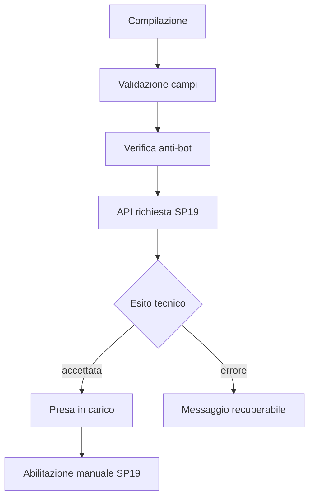
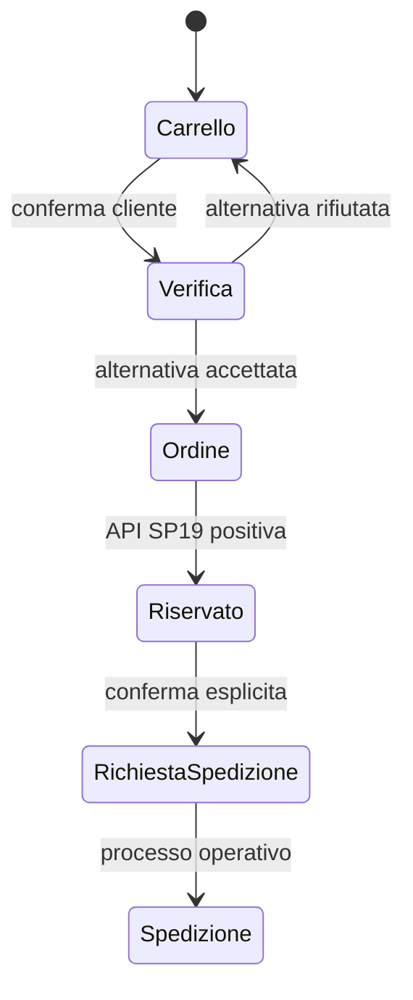

# Area clienti B2B

## Obiettivo della proposta

L’area B2B non è una riproduzione grafica delle due interfacce legacy fornite come riferimento. Le schermate esistenti sono state usate per comprendere quantità di dati, terminologia e operatività; la nuova proposta organizza invece le funzioni in base ai compiti che il cliente deve completare.

Questa scelta risponde alla richiesta emersa nel confronto con il cliente: la società di sviluppo deve proporre una mappa, comportamenti e soluzioni di usabilità attuali, da validare poi con chi conosce il processo SP19. Il prototipo costituisce quindi una proposta concreta e discutibile, non presume che SP19 abbia già definito ogni dettaglio tecnico.

## Mappa proposta

| Area | Scopo | Contenuti legacy ricondotti nell’area |
|---|---|---|
| Dashboard | priorità, anomalie, merce pronta, scadenze | riepiloghi prima distribuiti fra più pagine |
| Catalogo | rientro nell’esperienza di acquisto | catalogo pubblico/personalizzato |
| Carrello | quantità, prezzi, controllo finale | carrello e disponibilità |
| Ordini | merce riservata e avanzamento | ordini cliente, ordini completati |
| Spedizioni | richieste esplicite, stato, tracking | spedizioni e DDT collegati |
| Documenti e pagamenti | fatture, scadenze, movimenti | fatture, pagamenti, balance, scadenzario |
| Profilo aziendale | anagrafica, recapiti, indirizzi | dettaglio cliente, indirizzi, cambio password |
| Corrieri | configurazione dei vettori utilizzabili | configurazioni corriere |

`RESI` non è esposto nella navigazione perché il processo non è ancora definito. È già previsto come feature disabilitata nella configurazione cliente.

## Pagine del prototipo

- `access.html?mode=login`: accesso clienti abilitati;
- `access.html?mode=request`: richiesta pubblica di accesso;
- `access.html?mode=reset`: recupero password;
- `account.html?client=demo-distributor&view=dashboard`: shell privata dimostrativa;
- parametro `lang=it|en`: selezione esplicita della lingua.

Le viste private disponibili sono `dashboard`, `cart`, `orders`, `shipments`, `documents`, `profile` e `carriers`. Il catalogo rimanda alla home pubblica.

## Confine fra prototipo e prodotto reale

Il repository dimostra interfaccia, stati, gerarchia e contratti dati. Non implementa sicurezza backend.

| Nel prototipo | Nel prodotto reale |
|---|---|
| checkbox che rende visibile il punto di controllo anti-bot | challenge del provider e token verificato dal backend |
| redirect alla sessione cliente demo | sessione prodotta dal servizio di autenticazione SP19 |
| file cliente selezionato da una allowlist statica | configurazione risolta server-side dall’identità autenticata |
| azioni con messaggio dimostrativo | chiamate API autenticate, idempotenti e tracciate |
| dati fittizi in `b2b-demo.json` | dati restituiti per il solo tenant autorizzato |
| download simulato | stream o URL firmato del document service |

Le pagine statiche non possono proteggere dati o risorse. `account.html` è consultabile senza credenziali perché è un mockup; la route reale dovrà essere protetta prima del rendering e ogni API dovrà ripetere autorizzazione e controllo del tenant.

## Flussi di accesso

### Richiesta di accesso



La presa in carico non equivale all’attivazione. Per evitare enumerazione di account e dettagli tecnici, il messaggio pubblico deve restare neutro.

### Login e reset password

1. Il client valida il formato minimo dei dati.
2. Il provider anti-bot genera un token monouso.
3. Il backend verifica token, rate limit e richiesta.
4. Il backend dialoga con SP19 senza esporre credenziali tecniche al browser.
5. Solo dopo l’esito positivo viene creata la sessione.
6. Il reset deve restituire un messaggio neutro anche quando l’account non esiste.

## Flusso commerciale



Regole non negoziabili rappresentate nel prototipo:

- il carrello non riserva merce;
- disponibilità e prezzi sono verificati prima della creazione dell’ordine;
- riduzioni, sostituzioni o suddivisioni richiedono consenso esplicito;
- la merce è riservata soltanto dopo la creazione dell’ordine;
- ordine e richiesta di spedizione sono operazioni distinte;
- una conferma UI è definitiva soltanto dopo l’esito positivo del sistema remoto.

## Configurazione per cliente

`data/clients/demo-distributor.json` rappresenta il contratto della configurazione associata al cliente. Contiene:

- identificativo non sensibile della configurazione;
- moduli abilitati;
- ordine e voci di navigazione;
- widget della dashboard;
- permessi di presentazione;
- feature ancora non disponibili.

Esempio ridotto:

```json
{
  "clientId": "demo-distributor",
  "features": {
    "orders": true,
    "returns": false,
    "partialShipments": false
  },
  "navigation": [
    {"id": "dashboard", "labelKey": "navigation.dashboard", "icon": "home"},
    {"id": "orders", "labelKey": "navigation.orders", "icon": "orders"}
  ]
}
```

La configurazione non deve contenere prezzi, dati anagrafici o autorizzazioni affidabili lato client. È un view model: il backend rimane l’autorità per i permessi.

Nel prototipo il parametro `client` viene risolto tramite una allowlist; non è mai concatenato a un percorso. Nel prodotto reale non dovrà essere scelto dall’URL: l’associazione configurazione/cliente dovrà derivare dalla sessione.

## Modello dei dati

| File | Responsabilità |
|---|---|
| `data/b2b.json` | stringhe IT/EN e copy funzionale |
| `data/clients/demo-distributor.json` | moduli, navigazione e feature del cliente |
| `data/b2b-demo.json` | dati di dominio esclusivamente dimostrativi |

I dati dimostrativi sono intenzionalmente fittizi e usano indirizzi e-mail `.test`. I nomi presenti nelle schermate legacy non vengono pubblicati nel mockup.

## Contratti API da definire

Gli endpoint sono indicativi; nomi e payload definitivi dipendono dalle API SP19.

| Funzione | Operazione proposta | Requisiti minimi |
|---|---|---|
| richiesta accesso | `POST /access-requests` | anti-bot, idempotency key, consenso, esito neutro |
| login | `POST /sessions` | anti-bot, rate limit, cookie sicuro HttpOnly |
| reset | `POST /password-reset-requests` | anti-bot, esito neutro, token monouso |
| contesto cliente | `GET /me` | identità, tenant, feature e permessi effettivi |
| profilo | `GET/PATCH /me/profile` | allowlist campi, concorrenza, audit |
| indirizzi | `/me/addresses` | CRUD e vincolo indirizzo predefinito |
| corrieri | `/me/carriers` | CRUD, validazione, predefinito |
| carrello | `/me/cart` | versione, prezzi correnti, nessuna prenotazione |
| verifica | `POST /me/cart/availability-checks` | alternative strutturate e scadenza esito |
| ordine | `POST /me/orders` | idempotenza, snapshot prezzi, riserva atomica |
| spedizione | `POST /me/shipment-requests` | ordine eleggibile, indirizzo, corriere, conferma |
| documenti | `/me/invoices`, `/me/payments` | autorizzazione tenant e download protetto |

Ogni operazione mutativa deve prevedere identificativo di correlazione, timeout, retry soltanto quando sicuro, gestione degli errori e log senza dati personali non necessari.

## Stati UI richiesti

Ogni modulo dovrà avere almeno:

- `loading`: skeleton o stato di caricamento contestuale;
- `empty`: assenza dati spiegata e, se utile, azione successiva;
- `success`: conferma soltanto dopo la risposta remota;
- `validation`: errore associato al campo o alla scelta;
- `conflict`: disponibilità/prezzo modificati o risorsa aggiornata altrove;
- `forbidden`: funzione non disponibile per il cliente;
- `unavailable`: SP19 non raggiungibile, senza dettagli tecnici;
- `expired-session`: ritorno all’accesso conservando soltanto una destinazione sicura.

## Sicurezza

- autenticazione e autorizzazione verificate server-side su ogni chiamata;
- filtro del tenant applicato dal backend, mai affidato a un ID ricevuto dal browser;
- protezione contro accesso diretto a risorse di altri clienti (IDOR/BOLA);
- cookie `Secure`, `HttpOnly`, `SameSite` compatibile con l’architettura scelta;
- protezione CSRF per sessioni basate su cookie;
- rate limit differenziato su login, reset e richiesta accesso;
- verifica server-side del token anti-bot prima delle chiamate SP19;
- nessun messaggio contenente stack trace, endpoint interni o risposta grezza di SP19;
- download documenti autorizzato al momento della richiesta, non con URL permanente;
- audit delle modifiche a profilo, indirizzi, corrieri, ordini e spedizioni.

## Responsive e accessibilità

La tabella legacy resta una fonte utile per capire la densità desktop, ma non è adatta al mobile. Nel prototipo:

- la shell usa sidebar desktop e drawer mobile;
- le tabelle diventano schede con etichette per ogni valore sotto `800px`;
- azioni principali e stati restano visibili senza scorrimento orizzontale;
- dialog e drawer ripristinano il focus e si chiudono con `Esc`;
- colori di stato non sono l’unico modo con cui viene comunicato l’esito;
- campi read-only e modificabili sono esplicitamente distinti;
- `prefers-reduced-motion` riduce le transizioni.

## Opzioni da sottoporre a SP19

Prima dello sviluppo definitivo la società dovrebbe presentare e far approvare almeno queste scelte:

1. **Dashboard operativa o amministrativa**: priorità su merce pronta e ordini, oppure su credito, scadenze e documenti.
2. **Spedizione dall’ordine o da un’area aggregata**: il prototipo parte dall’ordine; una coda “merce pronta” può essere più efficiente per clienti con molti ordini.
3. **Alternative di disponibilità**: riduzione quantità, sostituzione offerta, split su offerte; ciascuna richiede regole di prezzo e consenso.
4. **Navigazione personalizzata**: soli moduli abilitati o anche tassonomia catalogo specifica per cliente.
5. **Documenti**: unica area o separazione fra fatture, pagamenti, DDT ed estratto conto per clienti ad alta operatività.
6. **Mobile**: sola consultazione o piena operatività per corrieri, conferma ordine e richiesta spedizione.

## Decisioni ancora aperte

- campi e consensi della richiesta accesso;
- tecnologia e modalità di autenticazione;
- provider anti-bot e fallback accessibile;
- regole password e reset;
- campi profilo modificabili e workflow di approvazione;
- schema definitivo e versione della configurazione cliente;
- regole dei corrieri e formato dei relativi codici;
- spedizioni parziali e multiple;
- stati ordine/spedizione e loro transizioni;
- tracking e provider esterni;
- disponibilità, formato e retention di fatture, DDT e pagamenti;
- processo resi.

Questi punti non vanno risolti nel solo front-end: richiedono esempi di payload, errori, vincoli operativi e responsabilità concordate con SP19.
